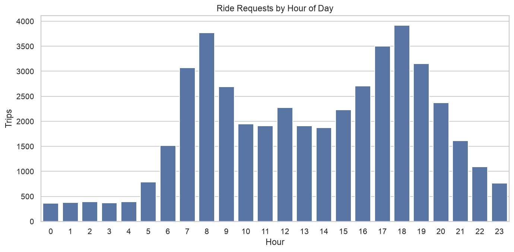
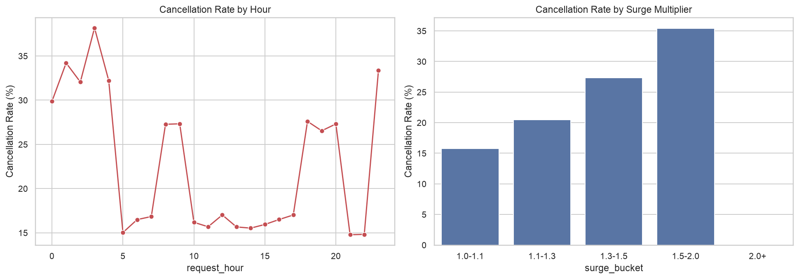
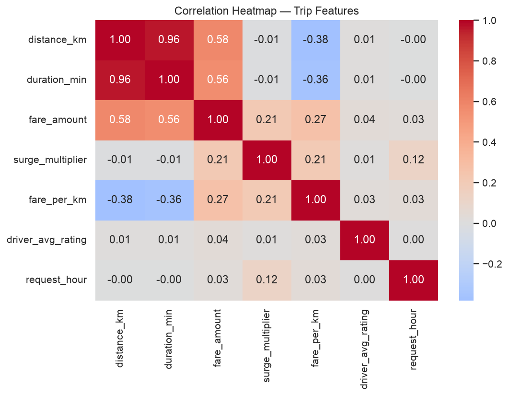
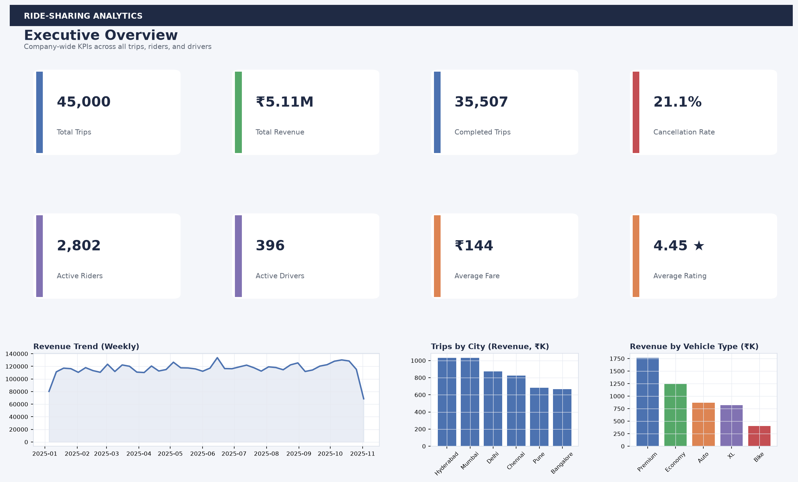
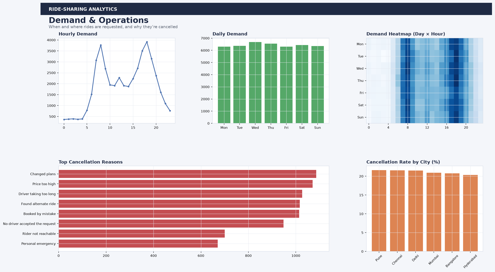
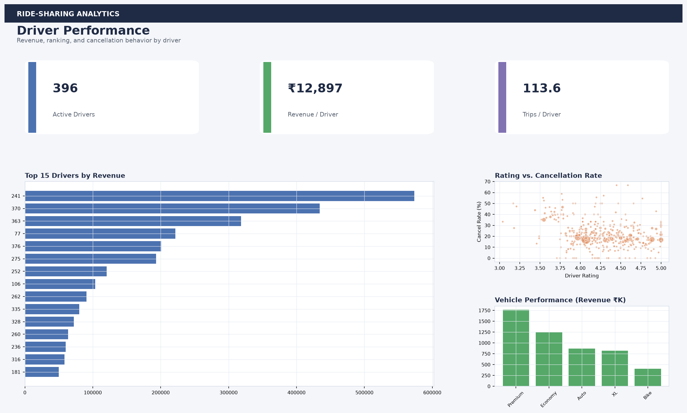
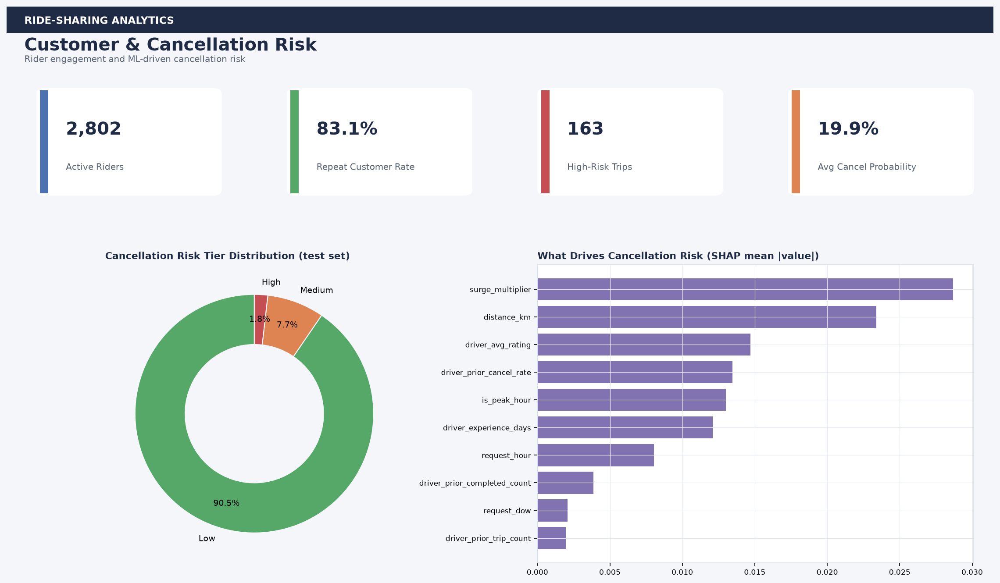

# 🚖 Ride-Sharing Analytics & Cancellation Prediction

### End-to-End Data Analytics & Machine Learning Portfolio Project

**SQL · Python · Statistics · Machine Learning · SHAP · Power BI · Streamlit**

[](https://www.python.org/)
[](https://www.mysql.com/)
[](https://pandas.pydata.org/)
[](https://scikit-learn.org/)
[](https://xgboost.readthedocs.io/)
[](https://shap.readthedocs.io/)
[](https://powerbi.microsoft.com/)
[](https://streamlit.io/)
[](LICENSE)

---

# 📌 Project Overview

Ride-sharing platforms need to balance customer demand, driver availability, revenue, customer retention, operational efficiency, and trip cancellations.

This project builds an **end-to-end analytics and machine learning solution** to understand ride-sharing operations and identify factors associated with cancellation behavior.

The project analyzes ride-sharing data across:

- Riders
- Drivers
- Vehicles
- Trips
- Locations
- Payments
- Ratings
- Cancellation behavior

### The workflow combines

- 🗄️ MySQL
- 🐍 Python
- 📊 Exploratory Data Analysis
- 📈 Statistical Analysis
- 🤖 Machine Learning
- 🔎 SHAP Explainable AI
- 📊 Power BI
- 🚀 Streamlit

The workflow transforms raw ride-sharing data into:

**Business KPIs → Analytical Insights → Predictive Models → Explainable AI → Business Recommendations**

> **Dataset:** Synthetic data created for portfolio and educational purposes. This project is not affiliated with Uber, Ola, Lyft, Rapido, or any other ride-sharing company.

---

## 🔗 Project Navigation

| Component | Description |
|---|---|
| 🗄️ [SQL](sql/) | Database design and business analysis |
| 🐍 [Python](python/) | Data cleaning, EDA, statistics and ML |
| 🤖 [Models](models/) | Trained model and preprocessing artifacts |
| 🔎 [ML Visualizations](images/ml/) | Model evaluation and SHAP results |
| 📊 [Dashboard](dashboard/) | Business dashboard previews |
| 📈 [Power BI](powerbi/) | Power BI project and dashboard documentation |
| 🚀 [Streamlit App](app/) | Interactive analytics and prediction application |
| 📄 [Reports](reports/) | Project documentation and reports |

---

# 🎯 Business Problem
Ride-sharing platforms need to balance **customer demand, driver availability, revenue, cancellations, customer satisfaction, and operational efficiency**.

This project analyzes ride-sharing operations and customer behavior to identify patterns that can support better business decisions.

## Key Business Questions

- 🚗 When is ride demand highest?
- 📍 Which cities and routes generate the most demand?
- 💰 Which cities, routes, drivers, and vehicle types generate the most revenue?
- ❌ What factors are associated with ride cancellations?
- 📈 How does surge pricing relate to cancellation behavior?
- 👨‍✈️ Which drivers demonstrate the strongest performance?
- 👥 Which customers are most valuable?
- 🔄 What is the repeat customer and retention rate?
- 🤖 Can cancellation risk be predicted before a trip?
- 🔎 Which features contribute most to cancellation risk?

## 🎯 Project Objectives

### 📊 Operations Analytics
- Analyze ride demand by hour, day, and city
- Identify peak booking periods
- Analyze pickup and drop locations
- Evaluate driver and vehicle performance

### 💰 Revenue Analytics
- Calculate total and average revenue
- Analyze revenue by city, driver, vehicle, and route
- Calculate average fare and fare per kilometer

### 👥 Customer Analytics
- Analyze active and returning riders
- Measure customer retention
- Perform RFM-style customer segmentation
- Identify valuable and at-risk customers

### ❌ Cancellation Analytics
- Calculate cancellation rate
- Analyze cancellation reasons
- Identify cancellation patterns
- Investigate the relationship between surge pricing and cancellations

### 🤖 Predictive Analytics
- Build cancellation prediction models
- Compare classification algorithms
- Evaluate model performance
- Explain predictions using SHAP

---

# 🏆 Key Results

## 📊 Statistical Findings

| Analysis | Result |
|---|---:|
| High-surge cancellation rate | **29.7%** |
| Lower-surge cancellation rate | **17.5%** |
| Distance vs Fare correlation | **r = 0.585** |
| Duration vs Fare correlation | **r = 0.563** |
| Driver Rating vs Cancellation | **r = -0.076, p < 0.001** |
| Fare Regression | **R² = 0.391** |

### Key Takeaways

- 📈 Higher surge conditions are associated with a higher cancellation rate.
- 💰 Distance and fare show a positive relationship.
- ⏱️ Trip duration and fare also show a positive relationship.
- 👨‍✈️ Driver rating has a statistically significant relationship with cancellation behavior.
- 🤖 Statistical findings are further investigated through machine learning and SHAP explainability.

---

# 📈 Exploratory Data Analysis

The project analyzes ride demand, revenue, cancellations, customer behavior, and operational performance using Python.

### Key EDA Areas

- 🚗 Trips by hour and day
- 📍 City-level demand
- 💰 Revenue and fare distribution
- 👨‍✈️ Driver performance
- 🚘 Vehicle performance
- ❌ Cancellation behavior
- 📈 Surge pricing
- 👥 Customer activity
- 🔗 Fare and trip-characteristic relationships

## 📊 Selected Visualizations

### Trips by Hour



### Cancellation by Hour & Surge



### Correlation Analysis



[📂 View all EDA visualizations →](images/eda/)

---

# 🤖 Machine Learning

The machine-learning component predicts whether a requested ride is likely to be cancelled before the trip.

### Models Evaluated

- Logistic Regression
- Random Forest
- XGBoost

### Model Evaluation

Models are evaluated using:

- Accuracy
- Precision
- Recall
- F1-Score
- ROC-AUC
- Confusion Matrix

### Current Model Performance

| Model | Accuracy | Precision | Recall | F1-Score | ROC-AUC |
|---|---:|---:|---:|---:|---:|
| 🥇 **Random Forest** | **80.4%** | **47.6%** | **23.7%** | **31.6%** | **0.677** |
| Logistic Regression | 77.4% | 35.0% | 21.5% | 26.6% | 0.616 |

### Best Current Model

**Random Forest** currently provides the strongest F1-Score and ROC-AUC among the evaluated models.

### 🔎 Explainable AI with SHAP

SHAP (SHapley Additive exPlanations) is used to interpret the model's cancellation-risk predictions.

The analysis helps identify which features contribute most to:

- Increasing cancellation risk
- Decreasing cancellation risk
- Overall model predictions

### Key Features

| Rank | Feature |
|---:|---|
| 1 | `surge_multiplier` |
| 2 | `distance_km` |
| 3 | `driver_avg_rating` |
| 4 | `driver_prior_cancel_rate` |
| 5 | `is_peak_hour` |
| 6 | `driver_experience_days` |
| 7 | `request_hour` |

### 📊 Model Evaluation Visualizations

- [Model Comparison](images/ml/model_comparison.png)
- [ROC Curve](images/ml/roc_curve.png)
- [Confusion Matrix](images/ml/confusion_matrix.png)
- [SHAP Feature Importance](images/ml/shap_feature_importance.png)
- [SHAP Summary Plot](images/ml/04_shap_summary.png)
- [SHAP Waterfall Example](images/ml/05_shap_waterfall_example.png)

[📂 View all ML visualizations →](images/ml/)

---
# 📊 Business Intelligence Dashboard

The project includes an interactive **Power BI dashboard** designed to convert ride-sharing data into actionable business insights.

The dashboard is organized into four analytical pages covering business performance, operations, driver performance, and customer cancellation risk.

---

## 📌 Dashboard Pages

### 1️⃣ Executive Overview

Provides a high-level view of overall ride-sharing performance.

**Key KPIs:**

- 🚗 Total Trips
- 💰 Total Revenue
- ✅ Completed Trips
- ❌ Cancellation Rate
- 👥 Active Riders
- 👨‍✈️ Active Drivers
- ⭐ Average Driver Rating
- 💵 Average Fare

**Key Analysis:**

- Overall business performance
- Revenue trends
- Trip volume
- Completion vs cancellation
- City-level performance
- Vehicle-type performance

---

### 2️⃣ Demand & Operations

Analyzes ride demand and operational patterns.

**Key Analysis:**

- 📈 Trips by hour
- 📅 Trips by day
- 🏙️ Demand by city
- 📍 Pickup and drop locations
- 🚗 Vehicle-type demand
- ⚡ Peak-hour demand
- ❌ Cancellation patterns
- 📈 Surge pricing behavior

**Business Questions:**

- When is demand highest?
- Which cities generate the most trips?
- When should additional drivers be available?
- Which periods experience higher cancellation rates?

---

### 3️⃣ Driver Performance

Evaluates driver productivity, ratings, revenue contribution, and cancellation behavior.

**Key Metrics:**

- 👨‍✈️ Trips per driver
- 💰 Revenue per driver
- ⭐ Driver rating
- ❌ Driver cancellation rate
- 🏆 Top-performing drivers
- 🚘 Vehicle performance

**Business Questions:**

- Which drivers generate the most revenue?
- Which drivers have higher cancellation rates?
- Which drivers have stronger ratings?
- Which vehicle types perform best?

---

### 4️⃣ Customer & Cancellation Risk

Focuses on customer behavior, retention, segmentation, and cancellation prediction.

**Key Analysis:**

- 👥 Customer segmentation
- 🔄 Customer retention
- 💰 Customer value
- 🚦 Cancellation probability
- ❌ High-risk rides
- 🔎 SHAP feature importance
- 📊 Cancellation drivers

**Business Questions:**

- Which customers are most valuable?
- Which customers may be at risk of churn?
- Which rides have a high cancellation probability?
- What factors contribute to cancellation risk?

---

# 🖥️ Dashboard Preview

### Executive Overview



---

### Demand & Operations



---

### Driver Performance



---

### Customer & Cancellation Risk



---

## 🎛️ Interactive Filters

The dashboard supports interactive filtering across key business dimensions, including:

- 📅 Date
- 🏙️ City
- 🚘 Vehicle Type
- 💳 Payment Method
- ⚡ Surge Multiplier
- 🚦 Trip Status

These filters allow users to drill down from overall business performance into specific customer, driver, city, and cancellation patterns.

---

## 💡 Dashboard Insights

The dashboard helps stakeholders:

- Identify peak demand periods
- Monitor cancellation trends
- Compare city-level performance
- Evaluate driver performance
- Analyze customer behavior
- Identify high-risk rides
- Understand cancellation drivers
- Support data-driven operational decisions

---

[📂 View Dashboard Assets →](dashboard/)

### 🔗 Dashboard Resources

| Resource | Description |
|---|---|
| 📊 Power BI Dashboard | Interactive business intelligence dashboard |
| 🖼️ Dashboard Images | Static dashboard previews |
| 📁 Dashboard Folder | All dashboard-related assets |
| 📖 Dashboard Documentation | Dashboard design and KPI documentation |

### 🧰 Dashboard Technology

- **Power BI** — interactive business intelligence and reporting
- **DAX** — calculated measures and KPI logic
- **Power Query** — data transformation and preparation
- **Excel / CSV** — source data and supporting analysis

### 🎨 Dashboard Design Principles

The dashboard follows a business-focused design approach:

- Clear KPI cards for executive-level metrics
- Consistent visual hierarchy
- Interactive slicers and filters
- Minimal visual clutter
- Business-oriented chart titles
- Drill-down analysis where applicable
- Consistent metric definitions across pages
- Focus on actionable insights rather than decorative visuals

### 💼 Business Value

The dashboard converts raw ride-sharing data into decision-ready insights for:

- 📈 **Demand Planning** — identify peak periods and high-demand locations
- 🚗 **Driver Operations** — monitor driver productivity and performance
- ❌ **Cancellation Management** — identify patterns and high-risk rides
- 💰 **Revenue Optimization** — analyze revenue across cities, routes, and vehicle types
- 👥 **Customer Retention** — understand customer behavior and value
- 🎯 **Operational Decision-Making** — support data-driven business strategies

### 📌 Dashboard Summary

The Power BI dashboard brings together **operational, revenue, driver, customer, and cancellation analytics** into a single decision-support layer.

It enables stakeholders to move from:

**Raw Data → KPIs → Trends → Root Causes → Business Actions**


# 🚀 Streamlit Application

The Streamlit application brings the project's analytics and machine-learning workflow into an interactive interface.

## 📊 Analytics Dashboard

The dashboard provides interactive views across four major business areas:

- 📌 **Executive Overview**
- 🚗 **Demand & Operations**
- 👨‍✈️ **Driver Performance**
- 👥 **Customer & Cancellation Risk**

## 🤖 Cancellation Risk Predictor

The application estimates the probability that a ride will be cancelled before the trip.

### Prediction Inputs
- Vehicle type
- Pickup and drop locations
- Trip distance
- Surge multiplier
- Payment method
- Request date and time
- Rider historical behavior
- Driver rating
- Driver experience
- Driver historical cancellation behavior

### Prediction Output
The application provides:

- 🎯 Cancellation probability
- 🚦 Risk category
- 📊 Risk gauge
- 🔎 Feature contributions
- 🧠 SHAP-based prediction explanation

### 🔎 Explainable AI with SHAP

SHAP is used to explain individual cancellation-risk predictions.

The application shows which features contribute to increasing or decreasing the predicted cancellation risk, making the model easier to interpret from a business perspective.

---

## ▶️ Run Locally

Create and activate a virtual environment:

python3 -m venv .venv
source .venv/bin/activate

Install the project dependencies:

```bash
pip install -r requirements.txt
```

Run the Streamlit application:

```bash 
streamlit run app/streamlit_app.py 
```
The application will normally be available at:

```text 
http://localhost:8501
```
---

## 🌐 Live Demo

**Coming soon**

> The Streamlit application will be publicly deployed after final testing.

## 📖 Application Documentation

For detailed application architecture, dependencies, and setup instructions:

[View Streamlit App Documentation →](app/README.md) 

---

# 🗄️ SQL Analysis

The SQL layer transforms the ride-sharing database into business-ready data and actionable insights.

SQL is used for data exploration, KPI development, customer analysis, operational analysis, revenue analysis, cancellation analysis, and advanced analytical queries.

### SQL Concepts

- SELECT and filtering
- JOINs
- GROUP BY
- HAVING
- CASE WHEN
- Subqueries
- Common Table Expressions (CTEs)
- Window Functions
- RANK()
- DENSE_RANK()
- ROW_NUMBER()
- LAG()
- NTILE()
- Date & Time Functions
- Aggregate Functions
- Views
- Indexes

### 📂 SQL Analysis Modules

| File | Purpose |
|---|---|
| `01_create_database.sql` | Create the project database |
| `02_create_tables.sql` | Create relational tables and relationships |
| `03_load_data.sql` | Load data into the database |
| `04_basic_analysis.sql` | Basic business and operational analysis |
| `05_advanced_analysis.sql` | Advanced SQL analysis |
| `06_business_kpis.sql` | Calculate business KPIs |
| `07_customer_retention.sql` | Analyze customer retention |
| `08_customer_segmentation.sql` | Perform customer segmentation |
---

# 🐍 Python & Data Analysis

Python is used for data cleaning, exploratory data analysis, statistical analysis, feature engineering, machine learning, and model explainability.

### Python Workflow

Run the notebooks in the following order:

```text
01_data_generation.ipynb
        ↓
02_data_cleaning.ipynb
        ↓
03_eda.ipynb
        ↓
04_statistical_analysis.ipynb
        ↓
05_feature_engineering.ipynb
        ↓
06_cancellation_prediction.ipynb
        ↓
07_model_explainability.ipynb
```
### Python Libraries

- **Pandas** — data manipulation and analysis
- **NumPy** — numerical computing
- **Matplotlib** — data visualization
- **Seaborn** — statistical visualization
- **Plotly** — interactive visualization
- **SciPy** — statistical testing
- **Statsmodels** — statistical modeling
- **Scikit-learn** — machine learning
- **XGBoost** — gradient boosting
- **SHAP** — model explainability
- **Joblib** — model serialization

---

# 📈 Statistical Analysis

The project uses statistical methods to investigate relationships and differences in ride-sharing behavior.

### Statistical Techniques

- **Chi-Square Test** — tests associations between categorical variables
- **Welch's T-Test** — compares means between two groups
- **Pearson Correlation** — measures linear relationships between numerical variables
- **Regression Analysis** — analyzes relationships between predictors and outcomes
- **Confidence Intervals** — quantifies uncertainty around estimates
- **Effect Size** — measures the practical magnitude of observed differences

### Example Hypothesis

**H₀ (Null Hypothesis):** Surge pricing has no association with cancellation behavior.

**H₁ (Alternative Hypothesis):** Surge pricing is associated with cancellation behavior.

The analysis uses:

```text
Significance level (α) = 0.05
```

---

# ⚠️ Data Leakage Prevention

Data leakage was considered during model development to ensure that information from the outcome or future does not enter the prediction process.

The following post-outcome variables are excluded from predictive modeling:

- `trip_status`
- `cancellation_reason`
- Post-trip ratings
- Future rider behavior
- Future driver behavior

Historical rider and driver features are calculated using information available before the current trip.

The model evaluation uses a **time-based train/test split** to better represent a real-world prediction scenario.

---

# 🏗️ Project Architecture

The project follows an end-to-end analytics and machine-learning workflow:

```text
Raw Data
   │
   ▼
MySQL Database
   │
   ├──────────────► SQL Business Analysis
   │
   ▼
Python Data Pipeline
   │
   ├──────────────► Data Cleaning
   │
   ├──────────────► Exploratory Data Analysis
   │
   └──────────────► Statistical Analysis
                          │
                          ▼
                  Feature Engineering
                          │
                          ▼
                  Machine Learning
                    │           │
                    ▼           ▼
              Random Forest   XGBoost
                    │           │
                    └─────┬─────┘
                          ▼
                         SHAP
                          │
                          ▼
                 Cancellation Risk
                          │
                 ┌────────┴────────┐
                 ▼                 ▼
              Power BI         Streamlit
                 │                 │
                 └────────┬────────┘
                          ▼
                  Business Insights
```

---

# 📁 Repository Structure

```text
Ride-Sharing-Analytics-Cancellation-Prediction/
│
├── app/
│   ├── streamlit_app.py
│   └── README.md
│
├── dashboard/
│   ├── 01_executive_overview.png
│   ├── 02_demand_operations.png
│   ├── 03_driver_performance.png
│   ├── 04_customer_cancellation_risk.png
│   └── README.md
│
├── data/
│   ├── raw/
│   └── processed/
│
├── images/
│   ├── eda/
│   └── ml/
│
├── models/
│
├── powerbi/
│
├── python/
│   ├── 01_data_generation.ipynb
│   ├── 02_data_cleaning.ipynb
│   ├── 03_eda.ipynb
│   ├── 04_statistical_analysis.ipynb
│   ├── 05_feature_engineering.ipynb
│   ├── 06_cancellation_prediction.ipynb
│   └── 07_model_explainability.ipynb
│
├── reports/
│
├── sql/
│   ├── 01_create_database.sql
│   ├── 02_create_tables.sql
│   ├── 03_load_data.sql
│   ├── 04_basic_analysis.sql
│   ├── 05_advanced_analysis.sql
│   ├── 06_business_kpis.sql
│   ├── 07_customer_retention.sql
│   └── 08_customer_segmentation.sql
│
├── .gitignore
├── CONTRIBUTING.md
├── LICENSE
├── README.md
└── requirements.txt
```

---

# 🚀 Installation & Setup

## 1️⃣ Clone the Repository

```bash
git clone https://github.com/Beingnav/Ride-Sharing-Analytics-Cancellation-Prediction.git
cd Ride-Sharing-Analytics-Cancellation-Prediction
```
## 2️⃣ Create a Virtual Environment

### macOS / Linux

```bash
python3 -m venv .venv
source .venv/bin/activate
```
### windows

```bash
python -m venv .venv
.venv\Scripts\activate
```

## 3️⃣ Install Dependencies

```bash
pip install -r requirements.txt
```
---

## 🗄️ MySQL Setup

Run the SQL files in the following order:

```text
01_create_database.sql
        ↓
02_create_tables.sql
        ↓
03_load_data.sql
        ↓
04_basic_analysis.sql
        ↓
05_advanced_analysis.sql
        ↓
06_business_kpis.sql
        ↓
07_customer_retention.sql
        ↓
08_customer_segmentation.sql
```
---

## 🐍 Python Workflow

Run the notebooks in the following order:

```text
01_data_generation.ipynb
        ↓
02_data_cleaning.ipynb
        ↓
03_eda.ipynb
        ↓
04_statistical_analysis.ipynb
        ↓
05_feature_engineering.ipynb
        ↓
06_cancellation_prediction.ipynb
        ↓
07_model_explainability.ipynb
```
---

## 🚀 Run the Streamlit App

From the repository root:

```bash
streamlit run app/streamlit_app.py
```
---

# ⚠️ Limitations

This project uses synthetic ride-sharing data created for portfolio and educational purposes.

Therefore:

- Results should not be interpreted as actual industry statistics.
- Model performance depends on the synthetic data-generating process.
- Production deployment would require real-world operational data.
- Cancellation-risk thresholds should be calibrated using actual business costs.
- Production models would require monitoring for data drift and concept drift.
- Additional validation would be required before using predictions for operational decisions.

---

# 🔮 Future Scope

Potential future improvements include:

- 📈 Demand forecasting
- 👥 Customer churn prediction
- 👨‍✈️ Driver supply forecasting
- 🗺️ Geospatial and location-based analysis
- 💰 Dynamic pricing optimization
- ⚡ Real-time cancellation-risk prediction
- 🚀 FastAPI model deployment
- ☁️ Cloud database integration
- 🔄 Automated model retraining
- 📊 Model monitoring and drift detection
- ⚡ Real-time analytics

---

# 👨‍💻 Author

## Navdeep Taliyan

**Aspiring Data Analyst | Data Science Enthusiast**

### Core Skills

**SQL • Python • Power BI • Excel • Statistics • Machine Learning • Data Visualization**

### GitHub

https://github.com/Beingnav

### LinkedIn

https://www.linkedin.com/in/navdeep-taliyan-7270a824/

---

# ⭐ Support

If you find this project useful, consider giving the repository a ⭐ on GitHub.

---

# 📄 License

This project is licensed under the MIT License.
